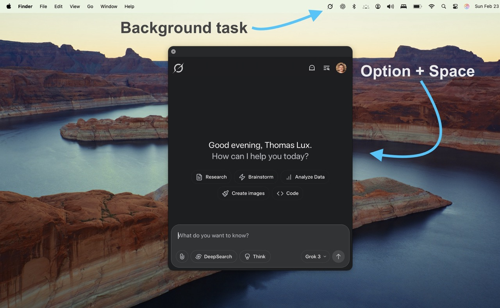
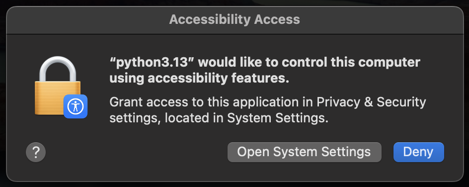
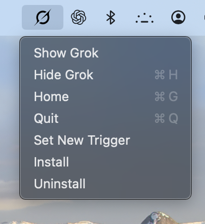

<p align="center">
  <h1 align="center"><code>macos-grok-overlay</code></h1>
</p>

<p align="center">
A simple macOS overlay application for pinning <code>grok.com</code> to a dedicated window and key command <code>option+space</code>.
</p>

> Forked and modified from [`tchlux/macos-grok-overlay`](https://github.com/tchlux/macos-grok-overlay) (MIT). See **Modifications from upstream** below.




## Installation

Install from source with [`pipx`](https://pipx.pypa.io/) (recommended — keeps the venv isolated from system Python):

```bash
git clone https://github.com/duarbdhks/macos-grok-overlay
pipx install -e ./macos-grok-overlay
pipx inject macos-grok-overlay pyobjc-framework-AVFoundation setproctitle
```

Or with plain `pip`:

```bash
python3 -m pip install ./macos-grok-overlay
```

Once installed, enable launch-at-login (also registers in **System Settings → General → Login Items & Extensions**):

```bash
macos-grok-overlay --install-startup
```

A macOS Accessibility prompt appears on first launch — approve it so the global `Option + Space` hotkey can be captured. The launcher source is at [`macos_grok_overlay/listener.py`](macos_grok_overlay/listener.py) if you want to inspect it.



Within a few seconds of approving Accessibility access, a small icon appears in the menu bar:




## Usage

Once launched, the app opens a window dedicated to `grok.com`. Log in once. After that, `Option + Space` toggles the overlay: pressing it hides the window, pressing it again summons it as the topmost overlay on top of other applications.

The menu bar dropdown exposes basic actions (Show / Hide / Back / Home / Clear Web Cache / Set New Trigger / Install Autolauncher / Uninstall Autolauncher / Quit).

To uninstall the autolauncher:

```bash
macos-grok-overlay --uninstall-startup
```

### Shell aliases (optional)

Add to `~/.zshrc` to control the LaunchAgent from the terminal:

```bash
_GROK_PLIST="$HOME/Library/LaunchAgents/com.$(whoami).macosgrokoverlay.plist"
alias grok-on='launchctl load "$_GROK_PLIST" 2>/dev/null && echo "grok-overlay started"'
alias grok-off='launchctl unload "$_GROK_PLIST" 2>/dev/null; pkill -f macos-grok-overlay; echo "grok-overlay stopped"'
```


## Keybindings

In addition to the global `Option + Space` toggle, the embedded `grok.com` web view ships with Vimium-like keybindings (auto-disabled while typing in an input):

| Key | Action |
|-----|--------|
| `j` / `k` | Scroll down / up (60px) |
| `h` / `l` | Scroll left / right (60px) |
| `d` / `u` | Scroll half page down / up |
| `gg` / `G` | Jump to top / bottom |
| `f` | Show link hints — type the yellow label to click |
| `Esc` | Cancel hints, blur the active input |
| `H` / `L` | Web view history back / forward |
| `⌘ + [` | Web view back (also available as "Back" in the menu bar) |
| `⌘ + F` | Open in-page find bar (search current conversation, smooth navigation) |

## Modifications from upstream

- **Vimium-like keybindings** injected into the web view (`vimium_shim.js`), including `f`-style link hints with pointer-event dispatch for Radix UI components.
- **Window fade in / fade out** animations on show/hide via `NSAnimationContext`.
- **Click-outside auto-hide** (`windowDidResignKey_`) — losing focus dismisses the overlay, with a guard for the "Set New Trigger" capture overlay.
- **Web view back navigation** — `⌘ + [` keyboard shortcut and "Back" menu item.
- **Notification API stub** — silences the `grok.com` "notifications blocked" warning that WKWebView triggers by default.
- **Process / bundle naming** — overrides Activity Monitor process name and the macOS menu-bar app name to `Grok` instead of `Python`.


## How it works

A thin `pyobjc` application embedding a `WKWebView` pinned to `grok.com`. Most logic handles styling (rounded corners, resizable borderless window, draggable strip), the global hotkey listener (which requires macOS Accessibility access), and the injected user scripts (background-color sampling, notification shim, Vimium keybindings).


## Credits & License

MIT — see [`LICENSE`](LICENSE).

- Original project: [`tchlux/macos-grok-overlay`](https://github.com/tchlux/macos-grok-overlay) (Copyright © 2025 Thomas Lux)
- Universal binary support: thanks to [`sumitduster-kiuzan`](https://github.com/tchlux/macos-grok-overlay/pull/22)
- Modifications in this fork: Copyright © 2026 duarbdhks

Not affiliated with xAI.
